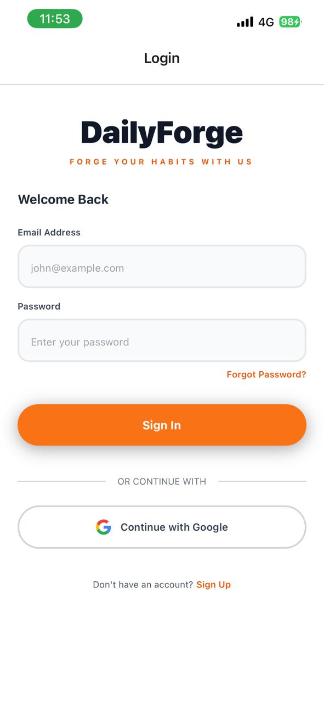
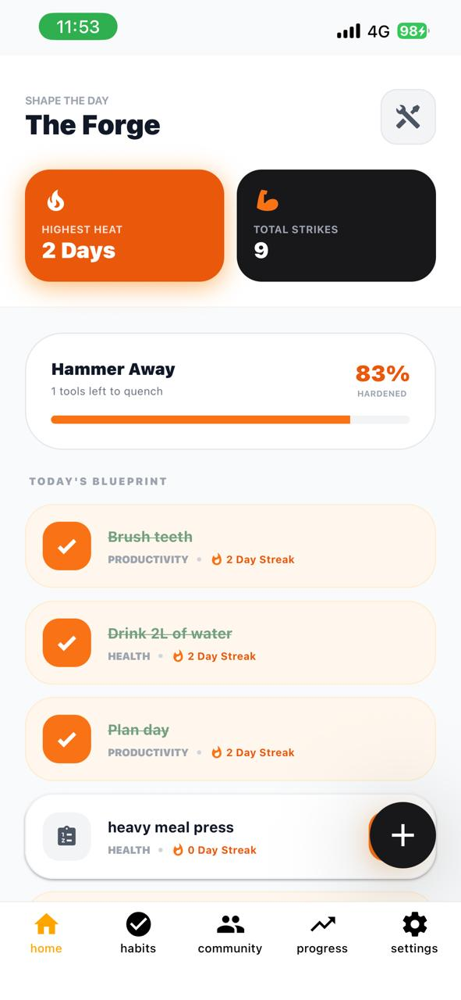
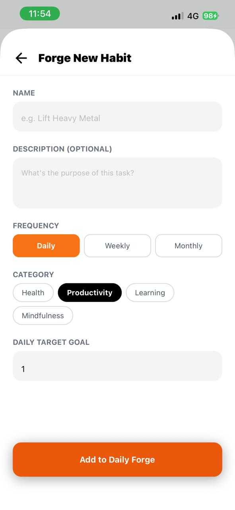
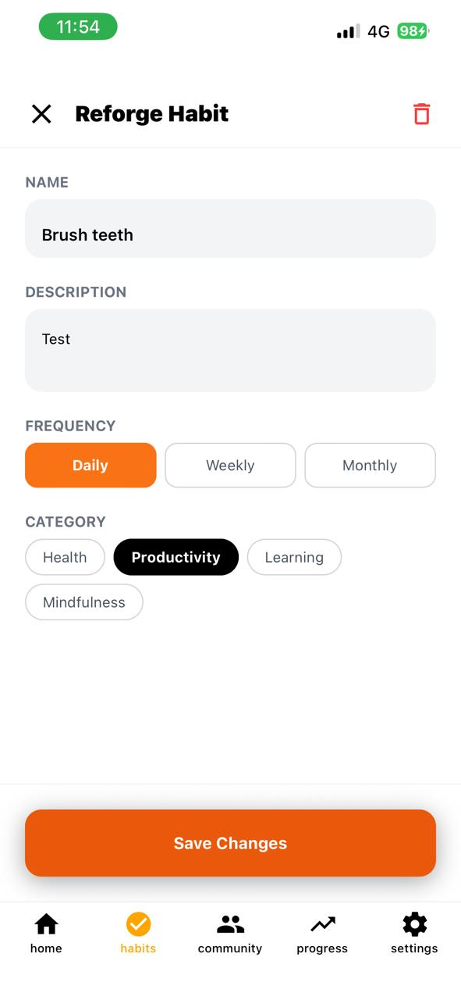
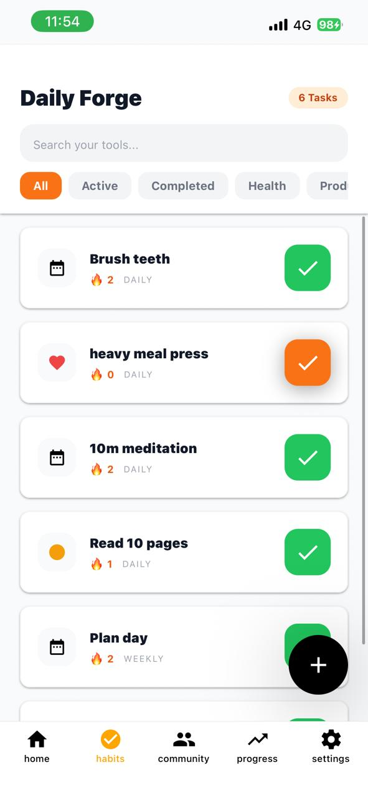
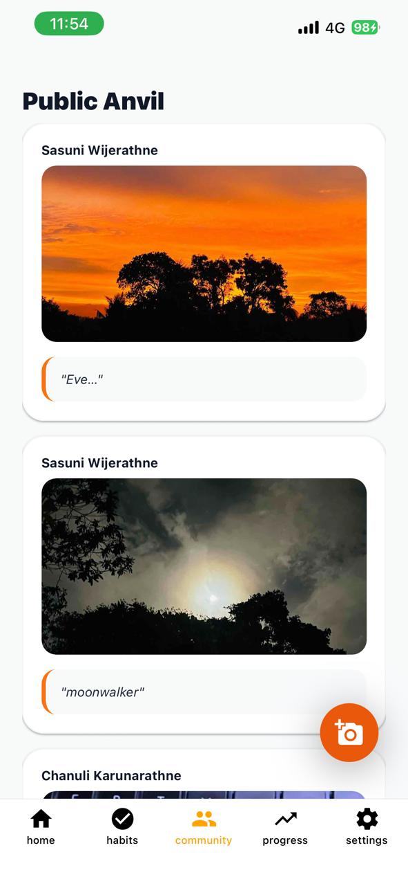
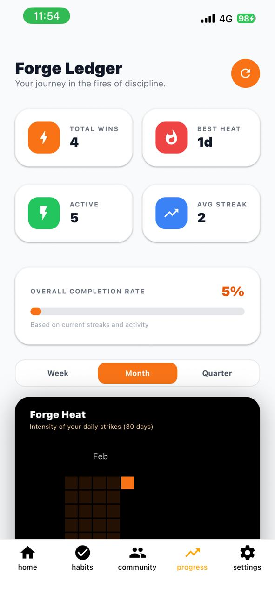
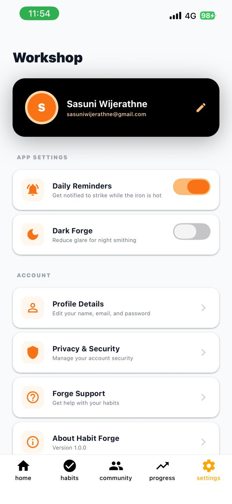
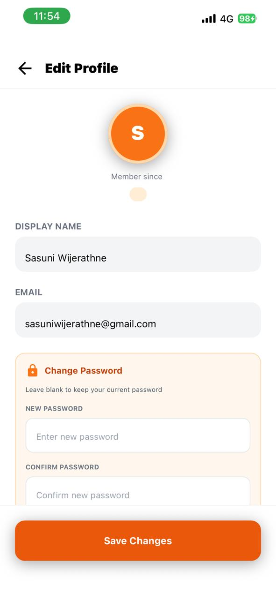

# DailyForge 
**Forge Your Future, One Strike at a Time.**

[](https://github.com/sasuniii0/DailyForge/releases/tag/v1.0.1)
[](https://reactnative.dev/)
[](https://firebase.google.com/)
[](https://expo.dev/)

---

## Project Overview

DailyForge is a rugged, blacksmith-inspired habit-tracking application built to turn the abstract concept of **"discipline"** into a visual craft. Unlike standard productivity apps, DailyForge treats every habit as a piece of iron that must be struck daily to stay hot.

The application includes secure authentication, full CRUD functionality, state management, navigation, and cloud-based data persistence using Firebase. This project is developed as the **final coursework for ITS 2127 – Advanced Mobile Developer (AMD)**.

---

## Download & Installation

### Android APK (Recommended)

<div align="center">

### **[Download DailyForge v1.0.0](https://github.com/sasuniii0/DailyForge/releases/tag/v1.0.1)**

**Latest Version:** v1.0.0 | **Size:** ~45 MB | **Min Android:** 5.0+

</div>

#### Quick Install via QR Code
<div align="center">


*Scan with your Android device to download instantly*
</div>

#### 🔧 Installation Steps
1. **Download** the [latest APK release](https://github.com/sasuniii0/DailyForge/releases/tag/v1.0.1)
2. **Enable installation from unknown sources:**
   - Go to **Settings → Security** (or Settings → Apps)
   - Enable **"Install from Unknown Sources"** or **"Install Unknown Apps"**
3. **Open** the downloaded APK file
4. **Tap Install** and wait for installation to complete
5. **Launch DailyForge** and start forging your habits! 🔨

> **Note:** You may see a security warning - this is normal for apps installed outside the Play Store. DailyForge is safe and open-source.

---

## Features

### The Forge (Habit Management)
- **Create, Update, and Delete** habits with a custom category system
- **Track current streaks** and "Best Heat" (all-time streaks)
- **Real-time synchronization** across devices via Firebase
- **Category-based organization** with custom icons

### The Forge Ledger (Analytics)
- **Visual Heat Map:** A contribution grid inspired by GitHub that visualizes habit intensity
- **Embers Logic:** Squares glow brighter orange the more habits you complete in a single day
- **Stat Cards:** Instant feedback on total wins and tool durability
- **Progress tracking** with detailed statistics

### The Public Anvil (Community)
- **Share "Sparks"** (updates) with the community
- **Social Proof:** Integrated camera to take and post photos of your progress
- **Sparking (Likes):** Support other smiths by "sparking" their posts
- **Community feed** with real-time updates

### Security & Sync
- **Firebase Authentication** for secure login
- **Cloud data persistence** - never lose your progress
- **Cross-device synchronization** - access habits anywhere
- **User profile management** with avatars

---

## Screenshots Preview

### Gallery of Masterpieces

| | | |
| :---: | :---: | :---: |
|  |  |  |
| **Sign In** | **Home** | **New Habit** |
|  |  |  |
| **Refining Habit** | **Habit Details** | **The Community** |
|  |  |  |
| **Progress** | **Forge Settings** | **Edit User Profile** |

---

## Technology Stack

### Frontend
- **React Native** - Cross-platform mobile framework
- **Expo** - Development and build toolchain
- **JavaScript/TypeScript** - Programming languages
- **React Navigation** - Navigation library (Stack & Tab)
- **NativeWind** - Tailwind CSS for React Native

### Backend & Services
- **Firebase Authentication** - User authentication
- **Firebase Firestore** - Cloud NoSQL database
- **Firebase Storage** - Image and file storage
- **Firebase Cloud Functions** - Serverless backend logic

### State Management
- **React Context API** - Global state management
- **React Hooks** - Modern state handling

### UI & Visualization
- **Expo Vector Icons** - Icon library (MaterialIcons)
- **React Native Chart Kit** - Data visualization
- **Expo Image Picker** - Camera and gallery integration

---

## Project Structure
```
DailyForge/
├── app/                      # Expo Router screens
│   ├── (auth)/              # Login & Register flows
│   │   ├── login.tsx
│   │   └── register.tsx
│   └── (dashboard)/         # Main app screens
│       ├── home.tsx
│       ├── community.tsx
│       ├── progress.tsx
│       └── settings.tsx
├── components/              # Reusable UI components
│   ├── StatCards.tsx
│   ├── HabitCard.tsx
│   ├── HeatMap.tsx
│   └── SparkCard.tsx
├── service/                 # Firebase configuration and API
│   ├── firebase.config.ts
│   ├── habitService.ts
│   ├── communityService.ts
│   └── authService.ts
├── types/                   # TypeScript interfaces
│   ├── habit.ts
│   └── user.ts
├── assets/                  # Images and static files
│   └── images/
├── global.css              # NativeWind styling
├── app.json                # Expo configuration
└── package.json            # Dependencies
```

---

## Build from Source

### Prerequisites
- Node.js (v18 or higher)
- npm or yarn
- Expo CLI
- Android Studio (for Android builds) or Xcode (for iOS builds)

### Installation Steps

1. **Clone the repository:**
```bash
git clone https://github.com/sasuniii0/DailyForge
cd DailyForge
```

2. **Install dependencies:**
```bash
npm install
# or
yarn install
```

3. **Setup Firebase:**
   - Create a project in the [Firebase Console](https://console.firebase.google.com/)
   - Add a Web App to get your configuration object
   - Enable Authentication (Email/Password)
   - Create a Firestore Database
   - Enable Storage for images
   - Copy your config and paste into `service/firebase.config.ts`:
```typescript
// service/firebase.config.ts
export const firebaseConfig = {
  apiKey: "YOUR_API_KEY",
  authDomain: "YOUR_AUTH_DOMAIN",
  projectId: "YOUR_PROJECT_ID",
  storageBucket: "YOUR_STORAGE_BUCKET",
  messagingSenderId: "YOUR_MESSAGING_SENDER_ID",
  appId: "YOUR_APP_ID"
};
```

4. **Start the development server:**
```bash
npx expo start
```

5. **Run on device:**
   - Scan the QR code with Expo Go app (iOS/Android)
   - Press `a` for Android emulator
   - Press `i` for iOS simulator

### Building Your Own APK
```bash
# Install EAS CLI globally
npm install -g eas-cli

# Login to Expo account
eas login

# Configure EAS (first time only)
eas build:configure

# Build APK for Android
eas build --platform android --profile preview

# Build for production
eas build --platform android --profile production
```

---

## Academic Details

- **Module:** ITS 2127 – Advanced Mobile Developer (AMD)
- **Course:** Graduate Diploma in Software Engineering
- **Institution:** IJSE
- **Student:** Sasuni Wijerathne
- **Project Type:** Final Examination Assignment
- **Framework:** React Native (Expo)
- **Backend:** Firebase
- **Submission Date:** 2026/02/10

---

## Key Learning Outcomes

This project demonstrates proficiency in:

**Mobile App Development** with React Native and Expo  
**State Management** using Context API and Hooks  
**Backend Integration** with Firebase services  
**User Authentication** and secure data handling  
**CRUD Operations** with Firestore database  
**Navigation** using React Navigation  
**UI/UX Design** with custom theming  
**Data Visualization** using charts and heatmaps  
**Image Handling** with camera and gallery integration  
**Cloud Storage** for user-generated content  
**Real-time Data Sync** across devices  
**App Distribution** and deployment

---

## Known Issues & Roadmap

### Known Issues
- None reported in v1.0.0

### Future Enhancements
- [ ] iOS support and App Store deployment
- [ ] Push notifications for habit reminders
- [ ] Dark mode theme
- [ ] Habit templates and suggestions
- [ ] Export data to CSV/PDF
- [ ] Social features: follow users, direct messages
- [ ] Gamification: achievements and badges
- [ ] Habit statistics and AI-powered insights
- [ ] Widget support for home screen
- [ ] Offline mode with local storage

---

## Contributing

This is an academic project, but feedback and suggestions are welcome!

1. Fork the repository
2. Create a feature branch (`git checkout -b feature/AmazingFeature`)
3. Commit your changes (`git commit -m 'Add some AmazingFeature'`)
4. Push to the branch (`git push origin feature/AmazingFeature`)
5. Open a Pull Request

---

## License

This project is created for academic purposes as part of the ITS 2127 course requirement.

**Academic Use Only** - Please contact for permission before using in commercial projects.

---

## Author

**Sasuni Wijerathne**

- Email: [sasuniwijerathne@gmail.com]
- LinkedIn: [linkedin](www.linkedin.com/in/sasuni-wijerathne-a3b517311)
- GitHub: [sasuniii0](https://github.com/sasuniii0)
- Portfolio: [portfolio](https://www.sasuni.me/)

---

## Acknowledgments

- **Anthropic** - For Claude AI assistance in development
- **Expo Team** - For the excellent development platform
- **Firebase** - For backend services
- **React Native Community** - For libraries and support
- **ITS 2127 Instructors** - For guidance and feedback
- **[Your University]** - For the learning opportunity

---

## Support & Feedback

- **Bug Reports:** [Open an issue](https://github.com/sasuniii0/DailyForge/issues)
- **Feature Requests:** [Open an issue](https://github.com/sasuniii0/DailyForge/issues)
- **Email:** your.sasuniwijerathne@gmail.com
- **Discussions:** [GitHub Discussions](https://github.com/sasuniii0/DailyForge/discussions)

---

## Project Stats


---

<div align="center">

### **Forge Your Future, One Strike at a Time** 

**by Sasuni Wijerathne**

[Download APK](https://github.com/sasuniii0/DailyForge/releases/tag/v1.0.1) • [Report Bug](https://github.com/sasuniii0/DailyForge/issues) • [Request Feature](https://github.com/sasuniii0/DailyForge/issues)

---

**Star this repo if you found it helpful!** 

</div>